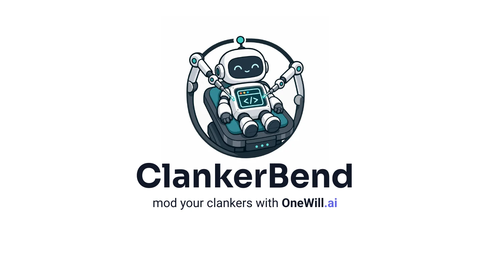
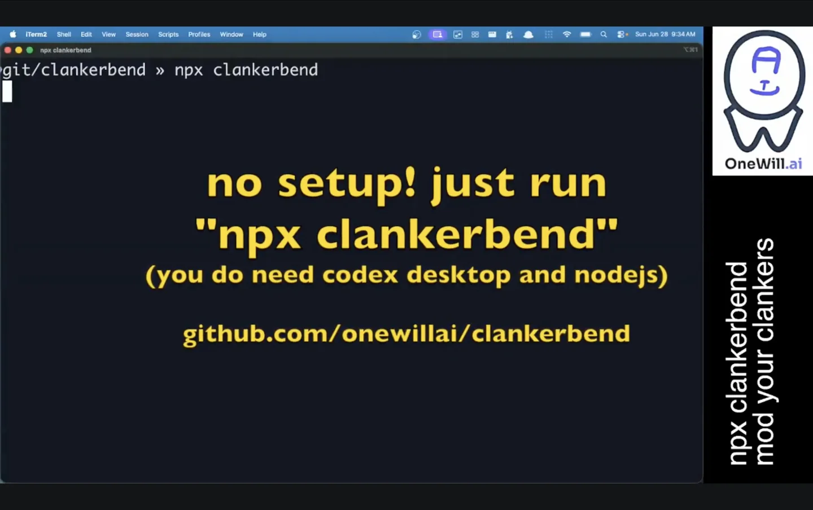

# ClankerBend

<p align="center">
  
</p>

ClankerBend lets you build Codex Desktop plugins without rebuilding or re-signing
Codex Desktop itself. It uses [CDP](https://x.com/OpenAIDevs/status/2065226355495895521)
to provide a more stable API for tasks such as transcript navigation, chat annotation,
attaching a file to the prompt window, opening the side panel, and so on.

<p align="center">
  <a href="https://www.youtube.com/watch?v=FcQUxiL6enc">
    
  </a>
</p>

ClankerBend is an independent [OneWill](https://onewill.ai) project compatible
with OpenAI Codex Desktop on macOS. It is not affiliated with or endorsed by
OpenAI (unless... 🥺).

## Quickstart

You'll need macOS with [Codex Desktop](https://chatgpt.com/codex/)
and [nodejs](https://nodejs.org/en/download). Then just:

```sh
npx clankerbend
```

That starts Codex Desktop with the default ClankerBend profile and bundled apps:

- **VimNav**: Vim-style transcript navigation, number rails, role jumps, search,
  and a side panel.
- **Sticky Notes**: select transcript text, click **Add note**, and the
  generated note will (1) create a markdown file and (2) attach itself to the
  current Codex prompt. Inspired by
  [@zats](https://x.com/zats/status/2070492220084326907).

## Runtime State

ClankerBend writes runtime state outside the package:

- macOS: `~/Library/Application Support/OneWill/ClankerBend`

Override with `ONEWILL_CLANKERBEND_STATE_DIR`.

## Security

ClankerBend binds to `127.0.0.1` on an OS-assigned ephemeral port. The launcher
prints the exact host URL, for example `Host: http://127.0.0.1:49152`.
`/clankerbend/*` endpoints require a bearer token by default. For local protocol
debugging, you can set `ONEWILL_CLANKERBEND_DISABLE_AUTH=1`.
